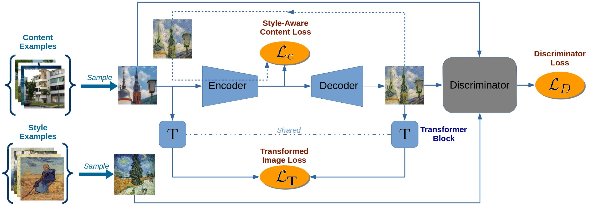
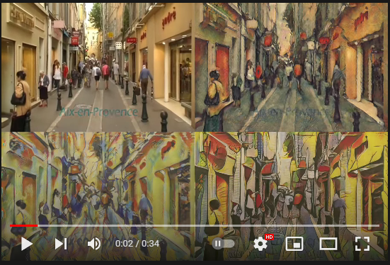

# Resources
A list of Style transfer resources.

1. [WIP](#WIP)
2. [Basics](#Basics)
3. [Single Image Style Transfer](#Single-Image-Style-Transfer)
  1. [Adjustable Style Transfer](#Adjustable-Style-Transfer)
4. [Real Time Style Transfer](#Real-Time-Style-Transfer)

## WIP
Really important:
- [Guided neural style transfer for shape stylization](https://journals.plos.org/plosone/article/file?id=10.1371/journal.pone.0233489&type=printable)
[Implementation](https://github.com/gttugsuu/Guided-Neural-Style-Transfer-for-Shape-Stylization) Logo guided style transfer
- [Arbitrary Style Transfer Using Neurally-Guided Patch-Based Synthesis](https://ondrejtexler.github.io/res/CAG_main.pdf) 
[Implementation](https://github.com/OndrejTexler/Neurally-Guided-Style-Transfer) Enhances neural style transfer results
Articles to check:
- [Arbitrary Style Transfer in Real-time with Adaptive Instance Normalization](https://arxiv.org/pdf/1703.06868.pdf)
- [StyleFormer: Real-time Arbitrary Style Transfer via
Parametric Style Composition](https://openaccess.thecvf.com/content/ICCV2021/papers/Wu_StyleFormer_Real-Time_Arbitrary_Style_Transfer_via_Parametric_Style_Composition_ICCV_2021_paper.pdf)
- [Improved Texture Networks: Maximizing Quality and Diversity in
Feed-forward Stylization and Texture Synthesis](https://openaccess.thecvf.com/content_cvpr_2017/papers/Ulyanov_Improved_Texture_Networks_CVPR_2017_paper.pdf)

## Basics
Style transfer algorithms strive to create a new image with the content of one or more images using the style of another.
It first gained popularity by the paper [A Neural Algorithm of Artistic Style](https://arxiv.org/pdf/1508.06576.pdf) published by Gatys et al.,
although most implementations use the one proposed by Johnson et al. ([Perceptual Losses for Real-Time Style Transfer and Super-Resolution](https://arxiv.org/pdf/1603.08155.pdf)),
such as PyTorch's [Fast Neural Style](https://github.com/pytorch/examples/tree/master/fast_neural_style).

  

We can separate style transfer algorithms into two classes:
- Single image style transfer
- Video or real time style transfer

In this document we will outline methods for both classes.

## Single Image Style Transfer
This class of algorithms aims to pass the style of one image into another's content. 

- [Perceptual Losses for Real-Time Style Transfer and Super-Resolution](https://arxiv.org/pdf/1603.08155.pdf) ([Implementation](https://github.com/pytorch/examples/tree/master/fast_neural_style)) is a relatively fast algorithm, which is used as the basis by many others.
It uses a pre-trained convolutional neural network (CNN) to train a transformer network on a style image and learn to pass its style into 
a content image.

  

- [Feature Visualization](https://distill.pub/2017/feature-visualization/) is another method of style transfer, although based
on the same principles of Johnson et al. implementation. It is done by peeking at the network's layers to see which ones activates
for the base content and style image, and training a new CNN which merges the desired activation layers. Many methods
can be seen [at this Lucid article](https://distill.pub/2018/differentiable-parameterizations/)([Lucid](https://github.com/tensorflow/lucid) might be deprecated, 
as it seems to have been lacking support in the recent years). One thing to note is the ability of these methods to also train style transfer from a style image 
into a [3D model](https://distill.pub/2018/differentiable-parameterizations/#section-style-transfer-3d).

  
  
  

- [Style Transfer by Relaxed Optimal Transport and Self-Similarity - STROTSS](https://arxiv.org/pdf/1904.12785.pdf) ([Implementation 1](https://github.com/nkolkin13/STROTSS), [Implementation 2](https://github.com/futscdav/strotss)) uses a new approach where
a mask is also used as an input at training time. The regions denoted withing the mask will have the style of the style image, while the other regions
will be the same as the content image. It also allows for aesthetic guidance- that is, you can select patches of the mask to have the same style,
allowing for more user control.

  
  

### Adjustable Style Transfer
Style transfer has many hyperparameters to tune during training time. A poor choice of values of these will result in a need to train the
entire network again. But worse still, we cannot fine-tune an already good model to make it better - we'd need to train it all again. That's
where adjustable style transfer comes into play. They aim to increase or decrease the style image weight at inference time, allowing to 
make small modifications of the generated image after training.

- [Real-Time Style Transfer With Strength Control](https://arxiv.org/pdf/1904.08643.pdf)([implementation](https://github.com/victorkitov/style-transfer-with-strength-control)) 
by Kitov, uses the transformer network of Johnson et al. (with a few modifications besides the ones described here) but adds a stylization strength parameter, 
&alpha;, as an input parameter to control the style transfer at inference time. It also adds another trainable parameter &beta; to the residual blocks of the network, 
where &alpha; is used.

  

- [Adjustable Real-time Style Transfer](https://arxiv.org/pdf/1811.08560.pdf)([implementation](https://github.com/gnhdnb/adjustable-real-time-style-transfer))
by Babaeizadeh, Ghiasi, also uses the same algorithm of Johnson et al., but adds a new network, &Lambda;, whose inputs &alpha;, generates an output
(&beta; and &gamma) which is fed into the transformer network to control the style strength of the generated images. 

  

## Real Time Style Transfer
Real time style transfer transfers the style of a given image to a video or live feed. Johnson et al. algorithm is typically used for toy applications due to its speed,
but it has a problem with temporal consistency, that is, two different frames with the same objects will have stylization applied differently. A few methods exist
to handle this issue, such as using optical flow. Some of these methods, however, can not be reasonably trained or be used without a cluster of high end GPUs and computers.
The methods listened here are only the ones that could be reasonably used by someone with a mid-to-high end GPU.

  

- Using Noisy Images was used by Element AI to stabilize video. It uses the same implementation of Johnson et al., but each image at training time 
is duplicated and noise is added to it. The root mean squared error of the output of the network for the clean and noisy image are then computated 
and added to the loss function. The advange of this method is its simplicity - however, as the network has to run predictions on two images,
training takes considerably longer.

  

- [Style-Aware Content Loss for Real-time HD Style Transfer](https://compvis.github.io/adaptive-style-transfer/) ([implementation](https://github.com/CompVis/adaptive-style-transfer)) by Sanakoyeu et al. proposes a style-aware content loss, which is trained jointly with a deep encoder-decoder network for real-time, high-resolution stylization of images and videos. It actually doesn't tackle the issue of temporal consistency, as the network does not present this problem.

  

  

